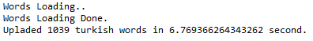
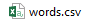

# Get Turkish Words with Web Scraping

In this project it is aimed to get Turkish words with web scraping. Words starting with the letters in the list of letters in the config.py file are retrieved from the website and saved in the words.csv file.

  
Used Library: 
<ul>
  <li>urllib</li>
  <li>BeautifulSoup</li>
  <li>time</li>
</ul>

  
Screenshots  

code output example:
   
when process finished, created this file;
   
output words example;
   
